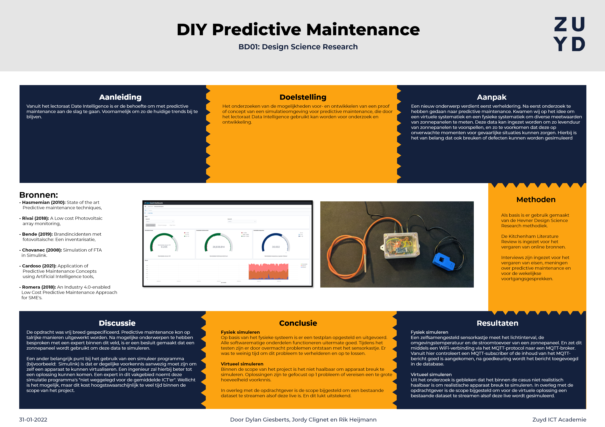
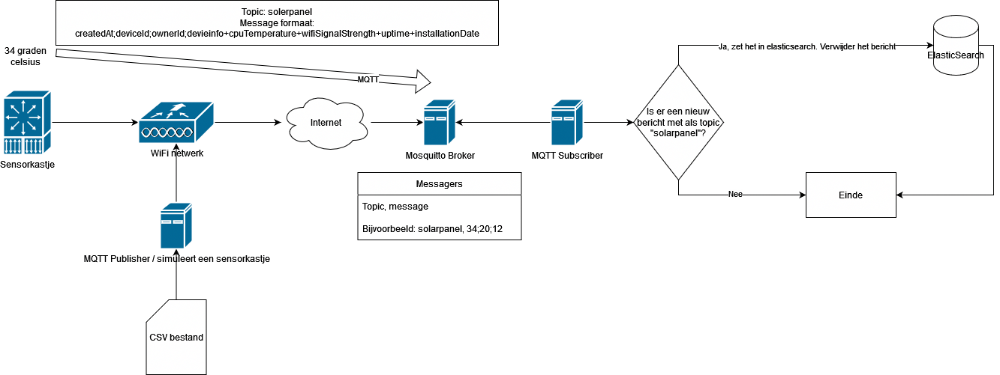

# Solar-ESP

Het doel van dit systeem is om de stroom die uitmondt uit een zonnepaneel (als ampere), de temperatuur rondom een zonnepaneel (in graden celsius), de dag-nachtcyclus te meten en de mate van licht door de zon (als lux). Deze waarden worden gemeten middels een stroomsensor (YHDC SCT013-050), een lichtsensor (BH1750) en een temperatuursensor (DS18B20, waterdichte variant).

De stroomsensor klemt zich om de output-kabel van het zonnepaneel. De temperatuursensor dient op een schaduwvrije plek onder het zonnepaneel te worden geplaatst. De lichtsensor is geïntegreerd in het centrale sensorkastje, samen met de microcrontroller (ESP32) die alle gegevens verzameld en doorstuurt.
De microcontroller is gebasseerd op de Espressif ESP32. Dit microcontroller platform zal middels WiFi verbonden zijn aan het internet. De ESP32 is voor dit domein geen kant-en-klare-oplossing, in principe voor geen enkel domein. Deze dient te worden geprogrammeerd. De ESP32 biedt simpelweg een microcontroller, een ingebouwde WiFi-modem en een hoop GPIO-poorten (General Purpose Input Output). Deze poorten zijn smalle pinnen aan de zijkanten van de ESP32. Deze GPIO-poorten kunnen stroom doorzetten (als output) of opnemen (als input). Met het opnemen bedoel ik de spanning (volt) en de stroom (ampere) meten. Verwar dit niet met de stroomsensor. De gemeten waarden via de GPIO-poorten zijn zeer laag. De stroomsensor doet als het ware niets anders dan waarden meten en die waarde zodanig in verhouding omzetten zodat deze door de GPIO-poorten gelezen kunnen worden. In de programmering van de microcontroller wordt deze verhouding weer omgezet.

## Van sensorkastje tot database

Het sensorkastje is verbonden met het WiFi-netwerk van de eigenaar van de zonnepanelen. In gevallen waarbij er geen beschikbaar WiFi-netwerk aanwezig is, kan er gebruik worden gemaakt van een GPRS-modem of een LoRa-modem. Dit valt buiten de scope van dit project. 

Zodra het sensorkastje is verbonden worden er verbinding gemaakt met de MQTT-broker. Deze MQTT-broker werkt als het ware als een internet forum. Gebruikers kunnen er berichtjes opzetten en andere gebruikers kunnen deze lezen. Deze MQTT-broker ontvangt de metingen van de sensorkastjes als bericht, met daarbij een standaard onderwerp “solarpanelanalytics”. Dit onderwerp is zeer belangrijk. Op basis van dit onderwerp kan de MQTT subscriber berichten aflezen. 

De MQTT subscriber is de schakel tussen de MQTT-broker en de database. Zodra er een bericht met de titel “solarpanelanalytics” binnenkomt leest de subscriber dit uit, converteerd het bericht naar een formaat dat de database gebruikt (dit past de data niet aan) en stuurt de data naar de database.

## Van database tot data scientist
De gebruikte databaseserversoftware heet OpenSearch (gebasseerd op ElasticSearch). Deze database is erg goed geïntegreerd met een van de meeste belangrijke data science tools: Python. De speciale python library genaamd “eland”1 laat haar gebruikers de data uit de OpenSearch-database virtueel openen. Virtueel als in enkel de data die op dat moment nodig is wordt uit de database gehaald. Dit vermindert de druk op de database en geeft een snellere response uit. Zodra de datascientist de data heeft opgehaald, kan deze direct worden doorgezet naar diverse machine learning en statistische analyse Python libraries.

# Gebruik
Zie [handleiding](Documentation/Handleiding.docx)
